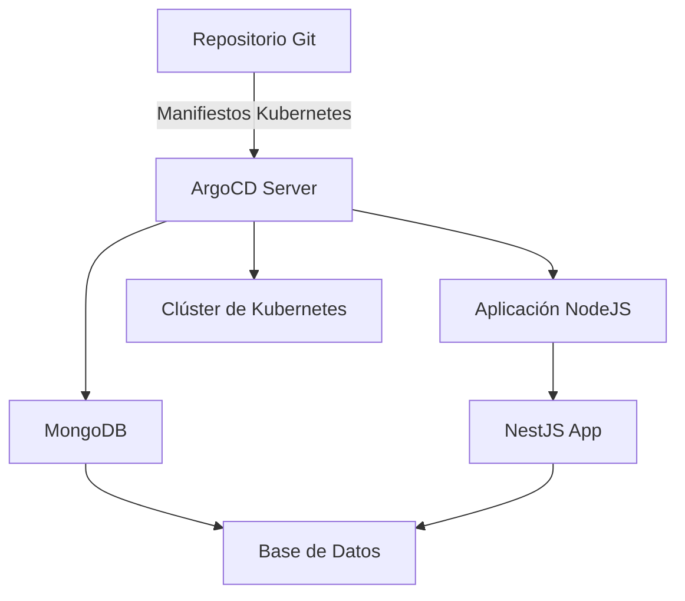

## Material Adicional de Soporte

Este repositorio incluye material adicional de soporte para la solución implementada. Se proporcionan diagramas que ilustran la arquitectura de la solución, facilitando la comprensión del flujo de trabajo de despliegue automatizado con ArgoCD y GitOps.

### Diagrama de Arquitectura

Repositorio Git: Contiene los manifiestos de Kubernetes para la aplicación y MongoDB.

ArgoCD Server: Sincroniza los manifiestos del repositorio Git y gestiona el estado de los recursos en el clúster.

Aplicación NodeJS: Representa la aplicación desplegada en Kubernetes.

MongoDB: Base de datos desplegada junto con la aplicación.

Clúster de Kubernetes: El entorno donde se despliegan los recursos.
